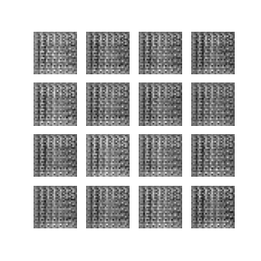

# Image data augmentation

### Using Deep Convolutional Generative Adversarial Networks (DCGAN), Variational Autoencoders and Geometric image generator

     
The biggest challeng in AI is the data, indeed, a good AI needs to be trained on a very large amount of annotated data. This data can be very hard to gather, this is why we use some Generative ways to augment the amount data we have in order to obtain a better AI.

In this application, we use the <a href="https://medmnist.com/">MedMnist</a> lungs data, the goal of the dataset is to detect <b>Pneumonia </b> from chest X-ray 28x28 imagees, the sample contains 5856 images.
We divided the data into 2 classes before training our generative networks.

The <a href="https://github.com/YousOuad/Data-augmentation/blob/main/Data_augmentation_for_medmnist.ipynb">notebook</a> shows a comparison between the 3 methods we used to generate data. The DCGAN does a very good job generating after a hundred iterations, the VAE model struggles more.

The generation of geometric data is a very known method to  improve the performance of image classifiers, consequently, we believe that combining DCGAN and geometric data augmentation models would yield a good boost in the performs of image classifiers.

This notebook was executed on Google Colab Pro for GPU boost.

